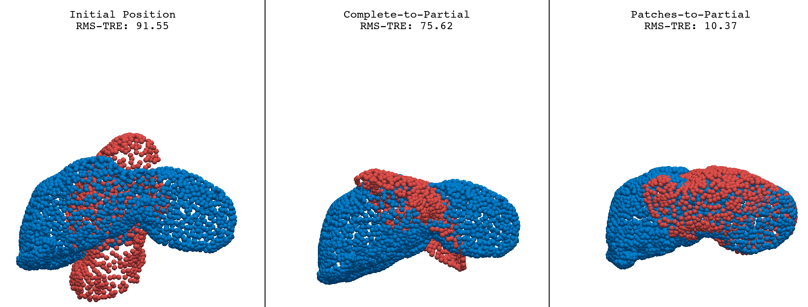

# Resolving the Ambiguity of Complete-to-Partial Point Cloud Registration for Image-Guided Liver Surgery with Patches-to-Partial Matching

## Introduction

This repository is a follow-up to the green [LiverMatch](https://github.com/zixinyang9109/LiverMatch) project. We provide *in silico* and *in vitro datasets* to facilitate automatic 3D-3D rigid registration for image-guided liver surgery using learning-based point cloud correspondence methods.

To address the prevalent complete-to-partial ambiguity challenge in the scenario of liver surgery, we propose the Patches-to-Partial (P2P) strategy, which represents an easily pluggable module that can be seamlessly integrated into learning-based registration pipelines without modifying their end-to-end structure or introducing additional trainable parameters.

## Theoretical Foundation

The theoretical foundation of our approach is two-fold. First, in comparison to the complete $\mathbf{S}$, a subset $\mathbf{S}_k$ that closely resembles the shape of $\mathbf{T}$ is likely to contain distinctive local structures, thereby reducing matching ambiguity. Second, the resulting set of transformations, $\mathcal{T} = {(R_1, t_1), (R_2, t_2), ..., (R_k, t_k)}$, introduces multiple hypotheses, increasing the likelihood of identifying the optimal transformation.

The first argument is based on the premise that the ambiguity in complete-to-partial matching is minimized in the limit of the source point cloud approaching the same extent and scale as the target point cloud. If the appropriate patch is selected, the registration problem effectively simplifies to a complete-to-complete scenario. The second argument then follows naturally: as the number of patches increases and selection is appropriately guided, the probability of identifying the correct transformation correspondingly improves.


---
## P2P Demo

To test the P2P module, we offer several samples. Please check the demo script:

```bash
P2P_Demo/demo.py
```

It will generate a visual output like :



### Dependencies

Ensure your environment includes:

* `torch`
* [`pyvista`](https://pyvista.org/)
* [`pointnet2_ops`](https://github.com/erikwijmans/Pointnet2_PyTorch)

---

## Datasets

You can download both in silico and in vitro phantom datasets from the following link:

📂 [Google Drive – Datasets](https://drive.google.com/drive/folders/1CpcMFqaiyg3eVnSEItCi1N8hmEeDopkd?usp=sharing)

All data is stored in `.npz` format. To quickly explore the contents, run the visualization script:

```bash
Eva_in_silico/vis_dataset.py
```

> ⚠️ This script requires a Python environment with `torch`, `numpy`, `open3D`, and `pyvista`. No specific version constraints apply.

As discussed in the paper, our datasets have limitations, particularly in terms of realistic cropping. We hope this work can inspire the development of more comprehensive datasets in the future.

---

## Baselines

If you want to check details about how to get results from baselines and integrate the P2P into Lepard and LiverMatch, you can download our [configuration files, scripts, and pretrained weights](https://drive.google.com/file/d/1L0mWJevuJVbdiOjW7o0wLeAFCpCmug8o/view?usp=sharing) of the following baselines:

* [Go-ICP](https://github.com/aalavandhaann/go-icp_cython)
* [RoITr](https://github.com/haoyu94/RoITr)
* [RegTR](https://github.com/yewzijian/RegTR)
* [LiverMatch](https://github.com/zixinyang9109/LiverMatch)
* [Lepard](https://github.com/rabbityl/lepard)

> You can use the Conda environment from [Lepard](https://github.com/rabbityl/lepard) to run all learning-based baselines. Download the baselines and put our files in the corresponding locations.

> Hope it may be useful in your projects.

---

## Evaluation

You may refer to the evaluation scripts provided in the `Eva_in_silico` and `Eva_in_vitro` folders:

### *In Silico* Evaluation

```bash
# Update the data paths before running
Eva_in_silico/Table_I&II.py                    
Eva_in_silico/Fig_4_test_data_property.py
Eva_in_silico/Fig_6_compare_error_curves.py
Eva_in_silico/Fig_7_plot_success_rate.py
```

### *In Vitro* Evaluation

```bash
# Update the data paths before running
Eva_in_vitro/Table_VII.py                      
Eva_in_vitro/Fig_8_compare_K.py
Eva_in_vitro/Fig_9_compare_ours_ransac.py
```
---
## Tips & Notes

* **Uniform point density** is critical for sim-to-real generalization. Thus, the preprocessing is very important.
* For **KPCov**, ensure the subsampling ratio enables multi-level downsampling. If it does not downsample the point cloud at each level, it may not extract features effectively.
* **Higher point cloud density** generally yields better registration accuracy. Here, we chose to normalize and voxelize (vox_size=0.04) the inputs. If you decrease the vox_size and the subsampling ratio of **KPCov**, you will get better results.
* **RoITr’s sparse superpoints** may degrade accuracy; consider tuning transformer parameters, which is not trivial.
* In the node-to-group approach used in **RoITr** and its variants, breaking the partial target into many small patches can hinder correspondence due to reduced saliency, as we already have a partial target point cloud.
* In deformation simulations, confining zero-displacement boundary conditions to a small region often introduces a significant **rigid component**. Aligning using volumetric vertices as markers helps reduce this rigid influence.
* If you do not remove the one-to-one correspondence in the simulations, you will get super good results for the simulation testing data, but unstable results in real data.

---

## Citation

If you get new knowledges from this work, please consider citing our paper :blush::

```bibtex
@article{p2p,
  author={Yang, Zixin and Heiselman, Jon S. and Han, Cheng and Merrell, Kelly and Simon, Richard and Linte, Cristian A.},
  journal={IEEE Journal of Biomedical and Health Informatics}, 
  title={Resolving the Ambiguity of Complete-to-Partial Point Cloud Registration for Image-Guided Liver Surgery with Patches-to-Partial Matching}, 
  year={2025},
  pages={1-14},
  doi={10.1109/JBHI.2025.3583875}
}
```


